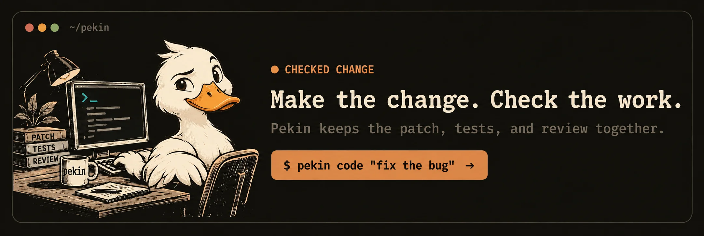

<h1 align="center">Pekin</h1>

<p align="center">
  <a href="https://github.com/keys-i/rady/actions/workflows/checks.yml"></a>
  <a href="https://crates.io/crates/pekin"></a>
  <a href="https://crates.io/crates/pekin"></a>
  <a href="LICENSE"></a>
</p>

<p align="center">
  
</p>

Pekin is a small GitHub service for repositories: it answers `@pekin` and reviews eligible Dependabot pull requests. You keep the final merge.

## Install

```sh
cargo install pekin --locked
pekin --help
```

With Homebrew:

```sh
brew tap keys-i/rady https://github.com/keys-i/rady
brew install keys-i/rady/pekin
```

Or build a checkout with Rust 1.85+:

```sh
cargo build --release --locked
target/release/pekin --help
```

## Connect a repository

1. Install the **Pekin** GitHub App for the repository.
2. Read the [Terms](docs/TERMS.md) and [Privacy policy](docs/PRIVACY.md).
3. Run setup as a repository administrator:

```sh
pekin setup --repo owner/repo --check test --accept-terms
```

Setup previews what it will do, writes a small public `.github/pekin.json`, creates a closed consent receipt, and adds Dependabot configuration only when it is missing. It never copies service credentials into the repository or changes branch protection. Review and commit the generated files.

`pekin dependasolve` is the scriptable setup form. It is not a direct review command:

```sh
pekin dependasolve --repo owner/repo --check test --apply --accept-terms
```

Omit `--solver-ref` to use the source setup resolves; provide `keys-i/rady@40_CHARACTER_COMMIT_SHA` only when deliberately holding a known release.

## What happens after setup

The central `keys-i/rady` service polls a bounded recent window of consented installations. Mentions and discovery use short-lived, installation-scoped tokens with only the permissions needed for that operation. Each selected review receives a repository-scoped token.

Review windows rotate fairly across eligible pull requests. Pekin honours the configured source pin, verifies Dependabot evidence, reads the selected CI checks, and leaves unsupported, grouped, or ambiguous updates as a `COMMENT` for human review. Pekin reserves Contents write access for an approved coding path, but mention and review tokens are explicitly narrowed to read-only. They cannot push or merge.

Ask in an issue or pull request:

```text
@pekin What changed here, and what should I check?
```

Replies are concise, evidence-based, and read-only. Polling is not real time; work begins on a later service cycle.

## Ask for a change

Write requests are deliberate. Start an issue or pull-request comment with `@pekin` and the exact change you want. Pekin records the request, base branch, and base commit, then asks the same person to approve that request by comment ID:

```text
@pekin fix the parser error for empty package names
@pekin approve 123456789
```

Before it does any write work, Pekin rechecks the open conversation, the same-author approval, the recorded request and base revision, and that the author still has write, maintain, or admin access. It uses a short-lived token scoped to that repository, checkpoints each completed step on an isolated `pekin/...` branch, and opens one pull request. It never merges.

If the base changes, an approval is invalid, access has changed, or checks fail, Pekin stops without changing the default branch. It posts a result when the run finishes; a later service pass marks abandoned claims expired after two hours when the bounded comment scan can find them. Claimed requests are never retried automatically. If a claim has no result, inspect the service run before making a fresh request and approval.

## Work locally

```sh
pekin code "fix the parser" --check test
pekin agent ask "where is this parser called?"
pekin agent follow-up RUN_ID "which failure should I fix first?"
```

Use `pekin runs`, `inspect`, `cancel`, `resume`, and `apply` to control retained work. Pekin can load repository guidance, selected skills and MCP servers; its terminal reports render Markdown and mathematics with accessible themes.

## Safety

App credentials stay only in `keys-i/rady`; they never enter child processes. Mentions and reviews send bounded evidence to their selected provider. An approved hosted edit runs a constrained provider CLI that may read and send repository files it selects for that task; its selected provider API key reaches only that scrubbed client child, never the target repository, prompt, or logs. Hosted editing stops before launch when a repository contains `.gemini`, `.env`, or `GEMINI.md`, because the harness would otherwise load target-controlled configuration. See [Privacy](docs/PRIVACY.md).

## Documentation

Coming from Rady? [Upgrade to Pekin 0.6.8](docs/UPGRADING.md). The [changelog](docs/CHANGELOG.md) follows the product from Rady 0.1.0 through Pekin 0.6.8; older names and commands there are history, not current setup instructions.

For the hosted service, read the current [Terms](docs/TERMS.md) and [Privacy policy](docs/PRIVACY.md). To help with the project, see [Contributing](.github/CONTRIBUTING.md), the [Code of Conduct](.github/CODE_OF_CONDUCT.md), and [Security](.github/SECURITY.md). Maintainers have a [release guide](docs/RELEASING.md). Source code is [MIT licensed](LICENSE).
