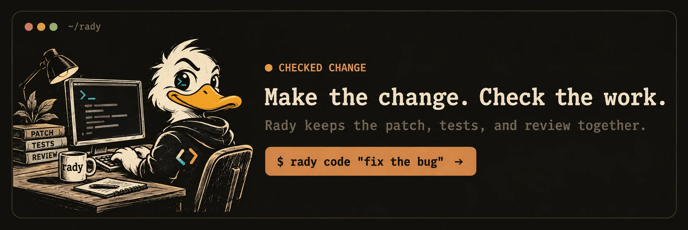

<h1 align="center">Rady</h1>

<p align="center">
  <a href="https://github.com/keys-i/rady/actions/workflows/checks.yml"></a>
  <a href="https://crates.io/crates/rady"></a>
  <a href="https://crates.io/crates/rady"></a>
  <a href="LICENSE"></a>
</p>

<p align="center">
  
</p>

Rady is a Rust CLI for checked changes, dependency reviews, and useful GitHub answers. It keeps the evidence close; you keep the final call.

- `rady code` makes an isolated, checked change
- `rady dependasolve` reviews Dependabot work from its diff and completed CI
- `@radyybot` gives a short, natural answer grounded in the issue or pull request

Terminal output is concise. Each run keeps a self-contained HTML report with safe Markdown, local maths, themes, and selectable text. Automation can use `--output json`.

## Install

```sh
brew tap keys-i/rady https://github.com/keys-i/rady
brew install keys-i/rady/rady
```

After it is published, install the current crate with:

```sh
cargo install rady --version 0.5.8 --locked
```

Build a checkout with Rust 1.85+:

```sh
cargo build --release --locked
target/release/rady --help
```

Code runs need an authenticated [Codex CLI](https://developers.openai.com/codex/cli/) or [Claude Code](https://docs.anthropic.com/en/docs/claude-code). GitHub setup needs `gh`. `dependasolver` remains a compatibility command for `rady dependasolve`.

## Make a checked change

```sh
rady code "Reject blank user names"
rady code --spec spec.json --directory /path/to/project
```

Rady isolates the work, limits scope, runs your checks, and gets a separate read-only review. A stopped run keeps its workspace and evidence. `--pr` also needs an explicit repository and fixed acceptance checks.

```sh
rady runs
rady inspect RUN_ID
rady cancel RUN_ID
rady resume RUN_ID
rady apply RUN_ID --directory /path/to/project
```

`apply` verifies the patch and target revision; it does not stage, commit, or publish.

## Add radyybot to a `keys-i` repository

Install the **radyybot** GitHub App for the repository, read the [Terms](docs/TERMS.md) and [Privacy policy](docs/PRIVACY.md), then preview and accept:

```sh
rady dependasolve --repo keys-i/REPO --check test
rady dependasolve --repo keys-i/REPO --check test --apply --accept-terms
```

This creates a closed, admin-authored consent receipt and writes its IDs, the policy versions, and selected checks to `.github/rady.json` (and adds Dependabot configuration only when it is missing). Central processing revalidates that receipt and the signer’s current admin access. It does not copy an App key or model key into the target repository. Rady’s central workflow in `keys-i/rady` holds the credentials and scans installed, consented `keys-i` repositories on a five-minute schedule; a reply or review can therefore take five minutes or more.

For another owner, or for real-time responses, run a hosted backend with its own secure secret store. GitHub Actions secrets in `keys-i/rady` cannot securely or instantly serve arbitrary owners.

`--check` names CI evidence to read. It neither runs a command nor creates a required status check. Dependasolve processes eligible work oldest first and can enable protected auto-merge for a clean, verified update. Conflicted updates remain for local `rady code` repair; the central service never sends its long-lived keys to a self-hosted runner.

## Ask on GitHub

```text
@radyybot What changed here, and what should I check?
```

Owners, members, and collaborators can use mentions on issues and pull requests. Replies are read-only, concise, and specific to the available evidence; a bare `@radyybot` shows usage. They cannot edit code or publish a change.

GitHub-hosted replies select compatible Gemini and Cerebras models exposed to the configured accounts, then use fallbacks. The catalogs describe accessible models, not a promise of a free tier or unlimited quota; Rady does not evade provider limits. Private repository evidence is sent only to providers explicitly opted in by the central operator.

## Safety

Rady separates generated from verified work, bounds subprocesses and evidence, removes common tokens from worker environments, and fails closed when evidence is missing. Custom adapters are privileged local programs, not sandboxes.

Reports use no scripts, CDNs, remote fonts, or raw untrusted HTML. `--theme auto`, `NO_COLOR`, redirected output, keyboard focus, and reduced motion are all supported.

[Upgrading](docs/UPGRADING.md) · [Releasing](docs/RELEASING.md) · [Security](docs/SECURITY.md) · [Terms](docs/TERMS.md) · [Privacy](docs/PRIVACY.md) · [MIT](LICENSE)
